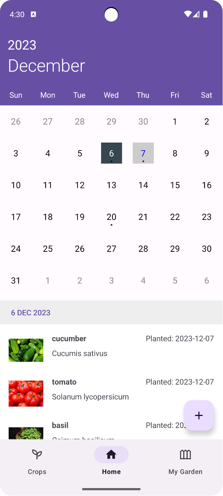
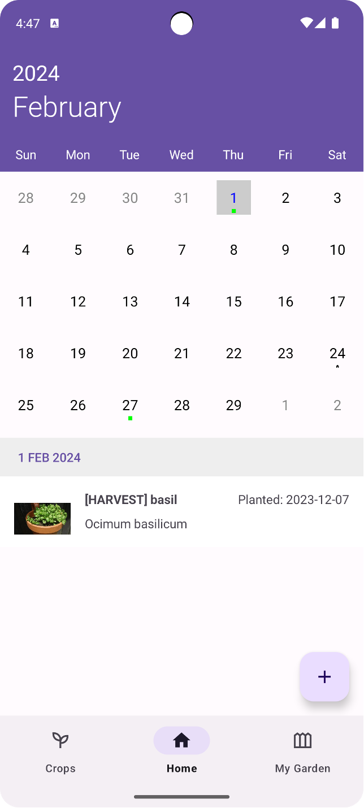
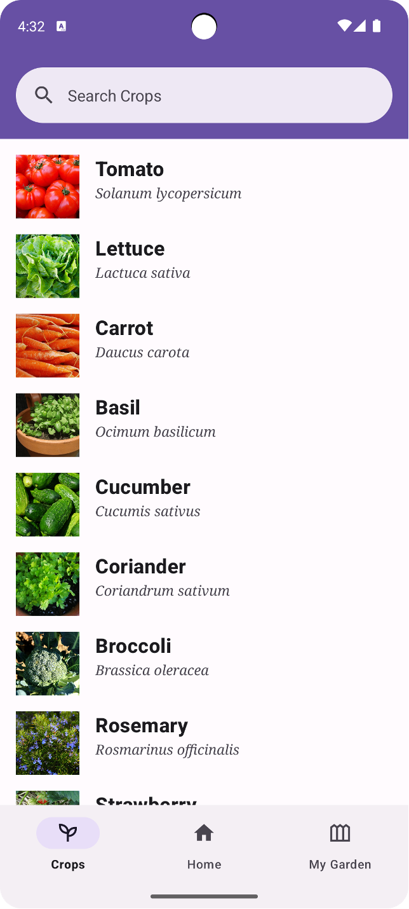
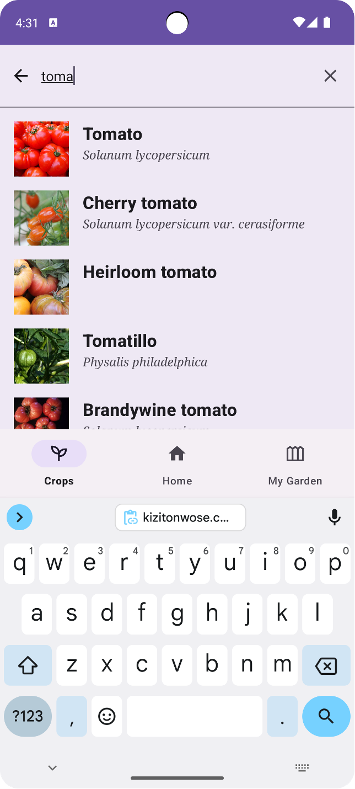
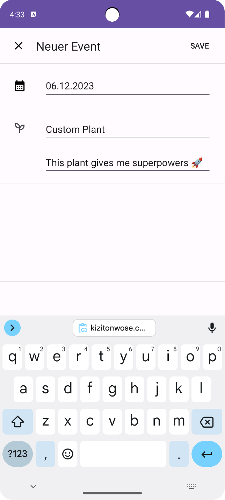
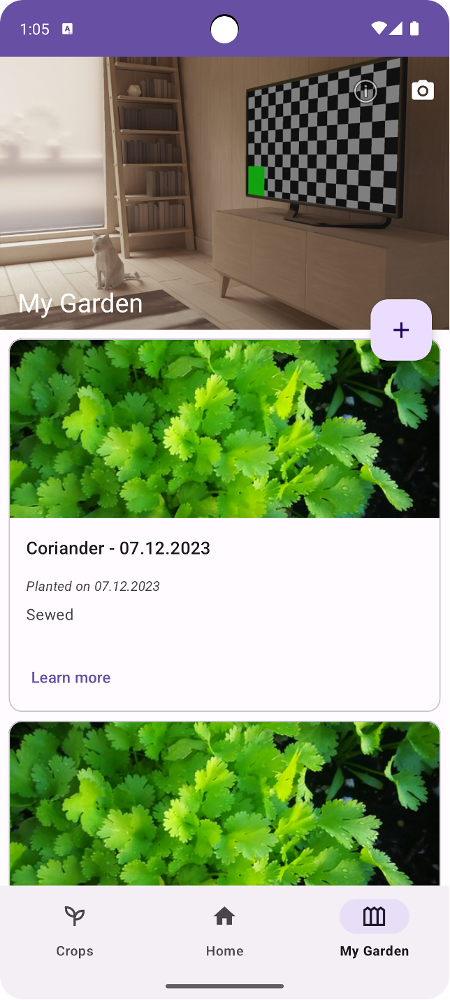

# Gartenzwergli

*Your simple gardening companion app*

## Functionality

The *Gartenzwergli* App can provide information about different crops for your everyday garden.
A user can search for crops, find companion plants and can find out how long it takes for a crop to
be harvested.
Additionaly a calendar for all the users crops can be managed on the Homepage.
The status of each plant is shown on the calendar and the user is able to set notifications for a
day when the crop is ready to be harvested.
An overview of all Plants can be found in the *My Garden* section.

## Wireframes

Before starting the development of the app, we created wireframes to get a better understanding of
the app and its functionality.
[Gartenzwergli Wireframes as PDF](https://github.com/biersoeckli/gartenzwergli/files/12783116/New.Project.1.pdf)

## Screenshots of the App

<table width="100%" style="text-align: center;">
<tr>
<td width="16%"> </td>
<td width="16%"> </td>
<td width="16%"> </td>
<td width="16%"> </td>
<td width="16%"> </td>
<td width="16%"> </td>
</tr>
<tr>
<td>Crop calendar</td>
<td>Crop ready to be harvested</td>
<td>Crop overview</td>
<td>Crop search</td>
<td>Create custom crop</td>
<td>"My Garden" overview</td>
</tr>
</table>

## How does the project achieve the required number of points for the audit?

*The goal lies at 18 points for teams of three*

* Using Kotlin instead of Java (3 times 3 points)
* Functionality per Function / Screen (1 - 5 points)
* Persistence / offline capability (1 - 3 points)
    * The app uses a local SQLite database to store the users crops and gardening beds
    * Download Crop Images from Web and store them locally
* Usage of webservices (1 - 3 points)
    * Using Growstuff API to get a list of crops
    * Using OpenFarm API to get details about a crop (e.g. medianDaysForFirstHarvest)
* Usage of notifications (1 - 3 points)
    * The app uses notifications to remind the user to harvest a crop
* Usage of actors / sensors (1 - 3 points)
    * The app uses the camera to make a photo of the bed
* Integration of Third party libraries (1 - 3 points)
    * Using Retrofit to make API calls
    * Using Room to store data in a local SQLite database
    * kizitonwose.calendarview to display a calendar
    * AndroidX Components

### Additional points

* Usage of WorkerManager to schedule Push Notifications